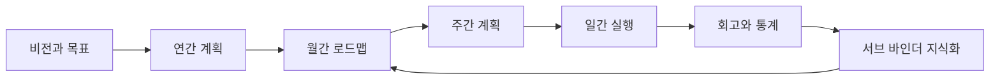

# 3P Binder형 스케줄 관리 웹 앱 제작 계획서

작성일: 2026-04-29

## 1. 목적

이 문서는 3P바인더의 공개 홈페이지, 상품 설명, 강의 소개 자료를 참고해 개인 스케줄 관리용 웹 앱을 설계하기 위한 계획서다.

중요한 전제는 3P바인더의 속지 디자인, 화면 구성, 문구, 상표, 특허 양식을 그대로 복제하지 않는 것이다. 공개 자료에서 확인되는 핵심 운영 원리인 목표관리, 시간관리, 기록관리, 지식관리, 리뷰 루틴을 웹 앱 UX로 재해석한다.

## 2. 참고 자료

- 3P바인더 공식 홈페이지: https://www.3pbinder.com/
- 3P바인더 소개 페이지: https://www.3pbinder.com/front/extra/extra_html.php?html=binder_intro
- 3P바인더 Notion 소개: https://3pbinder.notion.site/3P-fe37f0688d444065a691e91d0a1154bd
- 3P 노트/속지 상품 목록: https://www.3pbinder.com/front/product/product_list.php?pinid=10066
- 하루 10분 프로젝트 강의 소개: https://www.3pbinder.com/front/product/product_detail.php?pinid=&seq=1437
- 3P프로과정 소개: https://www.3pbinder.com/front/product/product_detail.php?pinid=&seq=844

## 3. 공개 자료 분석 요약

3P바인더는 단순 다이어리나 캘린더보다 넓은 자기경영 시스템을 지향한다. 공식 소개에서는 목표관리, 시간관리, 업무관리, 학업관리, 지식관리, 독서관리, 건강관리 등을 한 권의 바인더로 관리할 수 있다고 설명한다.

구조적으로는 메인바인더와 서브바인더 개념이 중요하다. 메인바인더는 매일 들고 다니며 자기관리와 시간관리를 수행하는 중심 공간이고, 서브바인더는 자료와 지식을 분류하고 보관하며 확장하는 공간으로 볼 수 있다.

상품 구성에서는 연간, 월간, 주간, 일간 스케줄 속지가 반복적으로 등장한다. 주간스케줄은 일주일을 한눈에 관리하는 역할, 일간스케줄은 24시간을 깊게 관리하는 역할, 위클리 라이트 플래너는 시간 사용 통계를 확인하는 역할이 강조된다.

강의 소개에서는 기록, 꿈과 목표, 월간맵, 주간 계획, 하루 10분 습관, 2주 실습 미션, 소그룹 피드백 등이 반복된다. 따라서 앱은 입력 화면만 잘 만드는 것보다 매일 쓰게 만드는 루틴, 리뷰, 피드백 구조가 중요하다.

## 4. 제품 콘셉트

임시 제품명: Life Binder Web

핵심 문장:

> 목표에서 오늘의 시간까지 연결하고, 기록을 다시 지식과 성과로 축적하는 웹 기반 자기경영 바인더

앱의 기본 흐름은 다음과 같다.

## 5. 핵심 사용자

### 5.1 직장인

- 업무 목표와 개인 목표를 함께 관리하고 싶다.
- 여러 프로젝트와 회의, 마감일을 주간 단위로 보고 싶다.
- 실제 시간을 어디에 쓰는지 통계로 확인하고 싶다.

### 5.2 프리랜서와 사업자

- 장기 목표와 매출, 콘텐츠, 고객관리 일정을 연결하고 싶다.
- 흩어진 아이디어와 업무 노트를 프로젝트별로 축적하고 싶다.
- 주간 리뷰를 통해 다음 행동을 정하고 싶다.

### 5.3 학생과 자기계발 사용자

- 학습 계획, 독서, 운동, 루틴을 한 화면에서 관리하고 싶다.
- 목표를 작게 나누어 매일 실행하고 싶다.
- 계획을 세우는 습관 자체를 만들고 싶다.

## 6. 정보 구조

앱의 메인 내비게이션은 실제 바인더의 인덱스 느낌을 살리되, 웹 UI에 맞게 다음처럼 구성한다.

1. 오늘
2. 주간
3. 월간
4. 연간
5. 목표
6. 프로젝트
7. 서브 바인더
8. 리뷰
9. 통계
10. 설정

## 7. 핵심 화면 설계

### 7.1 오늘 화면

목적: 사용자가 앱을 열었을 때 바로 오늘 해야 할 일을 알 수 있게 한다.

주요 요소:

- 오늘 날짜와 하루 진행률
- 오늘의 핵심 3가지
- 24시간 타임라인
- 미완료 할 일
- 빠른 메모
- 오늘의 회고
- 시간 카테고리별 사용량

권장 UI:

- 중앙: 시간 블록 타임라인
- 좌측: 오늘의 목표와 체크리스트
- 우측: 메모, 회고, 통계

### 7.2 주간 화면

목적: 일주일 계획과 실제 시간 사용을 한눈에 관리한다.

주요 요소:

- 월요일부터 일요일까지 7일 컬럼
- 시간대별 드래그 앤 드롭 일정 블록
- 이번 주 업무 목표
- 이번 주 개인 목표
- 주간 할 일
- 계획 시간과 실제 사용 시간 비교
- 주간 리뷰 작성 영역

핵심 기능:

- 일정 블록을 목표 또는 프로젝트와 연결
- 카테고리 색상 지정
- 반복 일정 생성
- 완료, 연기, 취소 상태 표시
- 주간 시간 사용 통계 자동 계산

### 7.3 월간 화면

목적: 장기 목표를 월간 실행 계획으로 전환한다.

주요 요소:

- 월간 캘린더
- 프로젝트별 마일스톤
- 이번 달 목표
- 월간 체크리스트
- 월말 리뷰

권장 기능:

- 프로젝트 필터
- 목표별 일정 보기
- 월간 집중 테마 설정
- 다음 달로 이월할 항목 선택

### 7.4 연간 화면

목적: 1년의 큰 방향과 주요 이벤트를 설계한다.

주요 요소:

- 12개월 로드맵
- 분기 목표
- 연간 핵심 프로젝트
- 중요한 기념일과 마감일
- 연간 리뷰

권장 기능:

- 목표를 분기와 월 단위로 배치
- 목표 달성률 표시
- 월간 계획으로 내려보내기

### 7.5 목표 화면

목적: 일정이 단순한 할 일 목록으로 흩어지지 않도록 상위 목표와 연결한다.

주요 요소:

- 사명 또는 핵심 가치
- 비전 문장
- 드림리스트
- 연간 목표
- 목표별 프로젝트
- 목표별 진행률

권장 기능:

- 목표를 업무, 건강, 관계, 성장, 재정 등 영역으로 분류
- SMART 형식 입력 보조
- 목표와 일정, 할 일의 연결 상태 표시

### 7.6 프로젝트 화면

목적: 업무와 개인 프로젝트를 일정, 할 일, 자료와 연결한다.

주요 요소:

- 프로젝트 개요
- 마감일
- 관련 목표
- 작업 목록
- 관련 일정
- 관련 지식 노트
- 프로젝트 회고

권장 기능:

- 칸반 보드
- 간트식 월간 보기
- 프로젝트별 시간 사용 통계

### 7.7 서브 바인더 화면

목적: 일정과 메모에서 나온 자료를 지식으로 축적한다.

주요 요소:

- 노트 컬렉션
- 독서 노트
- 강의 노트
- 업무 자료
- 아이디어
- 태그와 폴더

권장 기능:

- 오늘 메모를 서브 바인더로 보내기
- 프로젝트와 지식 노트 연결
- 독서 노트 템플릿
- 첨부파일 업로드
- 검색과 태그 필터

### 7.8 리뷰 화면

목적: 계획과 실행을 비교하고 다음 계획에 반영한다.

주요 요소:

- 일간 리뷰
- 주간 리뷰
- 월간 리뷰
- 목표별 회고
- 미완료 항목 처리

권장 질문:

- 이번 주에 가장 의미 있었던 성과는 무엇인가?
- 계획과 실제 사용 시간이 크게 달랐던 영역은 무엇인가?
- 다음 주에 줄일 일과 늘릴 일은 무엇인가?
- 목표와 연결되지 않은 시간 사용은 무엇인가?

### 7.9 통계 화면

목적: 사용자의 시간 사용 패턴을 시각화한다.

주요 요소:

- 카테고리별 시간 사용량
- 계획 대비 실제 사용 시간
- 목표별 투입 시간
- 집중 시간대
- 주간, 월간 변화 추이

권장 차트:

- 주간 누적 막대 차트
- 카테고리 도넛 차트
- 목표별 진행률 바
- 시간대별 히트맵

## 8. 핵심 기능 목록

### 8.1 MVP 필수 기능

- 회원가입과 로그인
- 목표 생성과 관리
- 연간, 월간, 주간, 일간 보기
- 일정 블록 생성, 수정, 삭제
- 할 일 생성, 완료, 이월
- 시간 카테고리 설정
- 주간 시간 사용 통계
- 일간 리뷰와 주간 리뷰
- 프로젝트 관리
- 서브 바인더 노트

### 8.2 2차 기능

- Google Calendar 연동
- Outlook Calendar 연동
- PDF 내보내기
- CSV 백업
- 반복 루틴 관리
- 2주 습관 챌린지
- 모바일 PWA
- 파일 첨부
- 템플릿 커스터마이징

### 8.3 3차 기능

- AI 주간 리뷰 요약
- AI 일정 재배치 제안
- 음성 메모
- OCR로 종이 메모 가져오기
- 팀 또는 가족 공유 바인더
- 코칭용 리포트

## 9. 데이터 모델 초안

### User

- id
- email
- name
- timezone
- createdAt

### Binder

- id
- userId
- name
- type: main 또는 sub
- createdAt

### Goal

- id
- userId
- title
- description
- category
- period: annual, quarterly, monthly
- startDate
- endDate
- status
- progress

### Project

- id
- userId
- goalId
- title
- description
- status
- startDate
- dueDate

### Task

- id
- userId
- projectId
- goalId
- title
- status
- priority
- dueDate
- estimatedMinutes
- completedAt

### ScheduleBlock

- id
- userId
- projectId
- goalId
- taskId
- title
- startAt
- endAt
- actualStartAt
- actualEndAt
- categoryId
- status
- memo

### TimeCategory

- id
- userId
- name
- color
- type: work, study, health, relation, rest, admin, custom

### DailyLog

- id
- userId
- date
- topThree
- memo
- review
- mood

### WeeklyReview

- id
- userId
- weekStartDate
- wins
- lessons
- timeReview
- carryOverTasks
- nextWeekFocus

### KnowledgeItem

- id
- userId
- binderId
- projectId
- title
- body
- tags
- sourceType: memo, book, lecture, meeting, idea
- createdAt

### BookNote

- id
- userId
- title
- author
- startedAt
- finishedAt
- keyIdeas
- actionItems
- linkedKnowledgeItemId

## 10. 주요 사용자 흐름

### 10.1 첫 사용 온보딩

1. 관심 영역 선택: 업무, 학습, 건강, 독서, 프로젝트 등
2. 올해의 목표 1개 입력
3. 이번 달 목표 1개 입력
4. 이번 주 핵심 행동 3개 입력
5. 오늘 일정 1개 생성
6. 첫 주간 화면으로 이동

### 10.2 매일 사용 흐름

1. 오늘 화면 진입
2. 오늘의 핵심 3가지 확인
3. 시간 블록에 일정 배치
4. 실행 후 실제 사용 시간 기록
5. 빠른 메모 작성
6. 하루 끝에 3줄 회고 작성

### 10.3 주간 리뷰 흐름

1. 이번 주 시간 통계 확인
2. 목표별 투입 시간 확인
3. 완료한 일과 미완료한 일 확인
4. 미완료 항목을 삭제, 이월, 위임, 보류 중 선택
5. 다음 주 집중 목표 설정

### 10.4 지식화 흐름

1. 회의 또는 독서 중 메모 작성
2. 메모를 프로젝트 또는 서브 바인더에 연결
3. 태그와 출처 추가
4. 관련 일정 또는 할 일 생성
5. 나중에 검색과 리뷰에서 재사용

## 11. UI 디자인 방향

### 11.1 전체 톤

- 실제 바인더의 질서감은 살리되, 종이 속지 복제처럼 보이지 않게 한다.
- 업무 도구답게 조용하고 밀도 있는 UI를 사용한다.
- 장식보다 가독성, 반복 사용성, 빠른 입력을 우선한다.

### 11.2 레이아웃

- 데스크톱: 좌측 내비게이션, 중앙 작업 영역, 우측 인스펙터 패널
- 태블릿: 좌측 내비게이션 접기, 중앙 중심
- 모바일: 오늘, 주간, 빠른 입력 중심

### 11.3 컬러

- 시간 카테고리별 색상은 명확하되 과하게 화려하지 않게 한다.
- 기본 배경은 흰색 또는 매우 옅은 회색을 사용한다.
- 업무, 개인, 건강, 학습 등 카테고리는 색상과 아이콘을 함께 사용한다.

### 11.4 인터랙션

- 일정 블록 드래그 앤 드롭
- 빠른 입력 단축키
- 체크박스 완료 처리
- 우측 패널에서 상세 편집
- 일정 블록 클릭 시 관련 목표와 프로젝트 표시

## 12. 기술 스택 제안

### Frontend

- Next.js
- React
- TypeScript
- Tailwind CSS
- shadcn/ui
- lucide-react
- dnd-kit
- date-fns
- Recharts

### Backend

- Supabase 또는 PostgreSQL
- Prisma
- Supabase Auth 또는 NextAuth

### 배포

- Vercel
- Supabase

### 추후 확장

- PWA
- IndexedDB 오프라인 저장
- Google Calendar API
- Outlook Calendar API
- OpenAI API 기반 리뷰 요약과 일정 제안

## 13. MVP 범위

첫 버전은 다음 기준을 만족하면 충분하다.

1. 사용자가 이번 주 목표와 일정을 한 화면에서 관리할 수 있다.
2. 사용자가 하루 24시간 계획과 실제 실행 시간을 기록할 수 있다.
3. 주간 시간 사용 통계가 자동으로 생성된다.
4. 목표, 프로젝트, 일정, 할 일이 서로 연결된다.
5. 일간 리뷰와 주간 리뷰를 작성할 수 있다.
6. 메모와 독서 노트를 서브 바인더에 저장할 수 있다.

MVP에서 제외할 항목:

- 외부 캘린더 양방향 동기화
- 팀 공유
- AI 기능
- 복잡한 PDF 편집
- 결제와 구독

## 14. 개발 로드맵

### 1주차: 기획과 설계

- 요구사항 확정
- 화면 와이어프레임 작성
- 데이터 모델 확정
- 저작권과 특허 리스크 검토

### 2주차: 프로젝트 기반 구축

- Next.js 프로젝트 생성
- 인증 구현
- 기본 레이아웃
- DB 스키마 적용

### 3주차: 목표와 프로젝트

- 목표 CRUD
- 프로젝트 CRUD
- 목표와 프로젝트 연결
- 기본 대시보드

### 4주차: 일정과 할 일

- 일간 화면
- 주간 화면
- 일정 블록 CRUD
- 할 일 CRUD
- 카테고리 색상

### 5주차: 리뷰와 통계

- 일간 리뷰
- 주간 리뷰
- 시간 사용 통계
- 계획 대비 실제 시간 비교

### 6주차: 서브 바인더

- 노트 CRUD
- 독서 노트
- 프로젝트와 노트 연결
- 검색과 태그

### 7주차: 반응형과 내보내기

- 모바일 최적화
- PDF 내보내기
- CSV 백업
- 접근성 점검

### 8주차: 테스트와 배포

- 통합 테스트
- 사용성 개선
- 성능 최적화
- Vercel 배포

## 15. 리스크와 대응

### 저작권과 특허 리스크

3P바인더의 속지 양식, 고유 문구, 화면 구성, 상표를 그대로 사용하지 않는다. 앱은 공개적으로 확인 가능한 자기관리 원리를 바탕으로 독자적인 UI와 데이터 구조를 설계한다.

### 습관화 실패 리스크

스케줄 앱은 입력이 귀찮으면 사용자가 이탈한다. 따라서 빠른 입력, 기본 템플릿, 하루 10분 루틴, 주간 알림을 MVP부터 고려한다.

### 기능 과잉 리스크

처음부터 모든 자기관리 기능을 넣으면 앱이 무거워진다. MVP는 목표, 주간 계획, 일간 실행, 주간 리뷰, 시간 통계에 집중한다.

### 모바일 사용성 리스크

주간 시간표는 모바일에서 좁다. 모바일은 전체 주간표보다 오늘, 빠른 입력, 이번 주 목록, 리뷰 중심으로 설계한다.

## 16. 성공 기준

MVP 출시 후 다음 지표를 본다.

- 사용자가 첫날 목표와 첫 일정을 5분 안에 만들 수 있는가?
- 사용자가 일간 기록을 3일 이상 연속 작성하는가?
- 사용자가 주간 리뷰를 최소 1회 완료하는가?
- 사용자가 시간 통계를 보고 다음 주 계획을 수정하는가?
- 목표와 연결된 일정 비율이 증가하는가?

## 17. 다음 작업

1. 화면 와이어프레임 제작
2. DB ERD 작성
3. MVP 백로그 작성
4. Next.js 프로젝트 스캐폴딩
5. 주간 화면 프로토타입 구현

